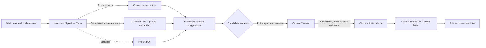
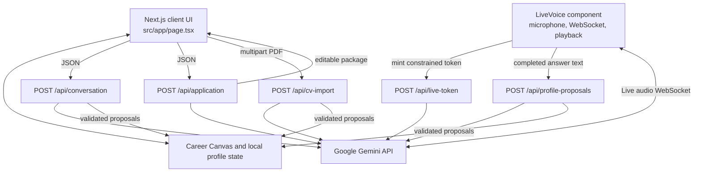

# Access

**A career companion that lets people tell their story in their own way.**

Access turns a conversation or an optional CV PDF into an evidence-backed career profile. Candidates review every suggestion, choose a fictional role, and create an editable CV and cover letter from details they have confirmed.

Access is designed with people who face barriers in traditional application forms in mind, and is available to everyone. It is a drafting aid—not a disability assessment, employability score, hiring system, or application-submission service.

> **Prototype status:** The application runs locally and has working Gemini-backed text, PDF-import, application-drafting, and optional Live voice paths. There is no public demo URL. Live voice is disabled by default. Some manual accessibility checks remain outstanding; this project does not claim WCAG conformance.

## Contents

- [What you can do](#what-you-can-do)
- [How it works](#how-it-works)
- [Architecture](#architecture)
- [Privacy and candidate control](#privacy-and-candidate-control)
- [Run locally](#run-locally)
- [Scripts and verification](#scripts-and-verification)
- [Repository map](#repository-map)
- [Known limits](#known-limits)
- [Project documentation](#project-documentation)

## What you can do

- **Choose how to communicate.** Use text throughout, or choose Speak and explicitly start an optional microphone session. Question wording can be set to Simple or Standard.
- **Tell your story naturally.** The interview asks one question at a time, supports skip and clarification, and uses a finite controller to guide introduction, experience, projects, education, review, and completion. Information can be picked up even when it arrives out of order.
- **Review a Living Career Canvas.** Gemini can propose skills, experience, and education with source evidence. Suggestions begin unconfirmed; edit, approve, or remove each one.
- **Import a CV PDF.** A PDF up to 5 MB can be read natively by Gemini. Extracted details remain suggestions for review.
- **Prepare an application.** Choose one of three clearly fictional sample roles. Access creates an editable CV and cover letter from confirmed, work-related profile evidence and the selected role.
- **Keep control of the result.** Edit both drafts, download them as `.txt`, or reset and delete the locally saved profile.
- **Set display preferences.** Larger text, higher contrast, and reduced motion change the interface. Preferences can be changed in Settings.

The app never submits an application or contacts an employer. It does not ask for or infer disability or medical information, and it filters sensitive details from generated application materials.

## How it works



### Candidate journey and state

The main journey is **Welcome → Story → Application**. Interview progression is managed separately by a validated controller: **Introduction → Experience → Projects → Education → Review → Complete**. It uses the shared profile to avoid asking for details already supplied and supports skipping sections, declining another entry, or ending early.

Candidate profile and preferences are held in browser memory and versioned `localStorage`. Persistence filters out unconfirmed skills, experience, and education; conversation history and pending suggestions remain in memory. A reset clears the saved profile. The text conversation sends its bounded history and selected question style to Gemini for the requested turn. A Live session sends its selected question style, current section, and a bounded profile summary when requesting a short-lived credential. Uploaded PDFs and completed voice answers are sent to Gemini for the requested extraction and are not stored by Access.

## Architecture

Access is a single Next.js App Router application. The browser owns the active interview/profile state and candidate approval. Server route handlers validate requests and model output, call Gemini using a server-side API key, and return typed results. Shared Zod contracts in `src/lib/contracts.ts` define the boundary between browser and server.



### Server endpoints

| Endpoint | Purpose | Important behavior |
| --- | --- | --- |
| `POST /api/conversation` | Text interview turns, skip, clarification, correction, and end | Bounded request/history; strict JSON output plus Zod validation; Gemini may select `propose_profile_updates`; server validates evidence and returns suggestions as pending. |
| `POST /api/application` | Create a CV and cover letter for a selected role | Server resolves the role from `src/lib/jobs.ts`; only confirmed, non-sensitive evidence is sent for drafting; generated output is checked before return. |
| `POST /api/cv-import` | Read one candidate-selected PDF | PDF MIME, signature, and 5 MB limit are checked; Gemini receives the PDF as native `inlineData`; proposed claims are checked against the document and returned unconfirmed. |
| `POST /api/profile-proposals` | Extract profile suggestions from a completed voice answer | Accepts only bounded answer text; validates source evidence and returns suggestions, never confirmations. |
| `POST /api/live-token` | Mint a constrained, short-lived Gemini Live credential | Same-origin check; disabled unless `GEMINI_LIVE_ENABLED=true`; the long-lived API key remains server-side. |

The optional voice path streams PCM audio directly between the browser and Gemini Live over a WebSocket. `public/live-pcm-worklet.js` captures microphone audio; `src/lib/live-audio.ts` encodes/decodes PCM; `LiveVoice` manages consent, connection, playback, interruption, transcript, and cleanup. Completed candidate answers are separately sent as text to the profile-proposal endpoint. Text mode remains a complete alternative with its own HTTP conversation history; both modes update the same Career Canvas and interview progression.

## Privacy and candidate control

- No login, database, analytics, employer integration, web scraping, or automatic application submission.
- `GEMINI_API_KEY` is read only by server routes. Never expose it with a `NEXT_PUBLIC_` variable or commit it.
- Access saves only confirmed profile claims and preferences in this browser’s `localStorage`. Text/voice conversation history and pending suggestions are in memory, not saved by Access.
- Text turns, requested drafts, completed voice answer text, and selected PDF content are sent to Google Gemini for the requested feature. Provider processing and retention are governed by Google and the API account’s terms; local storage does not control provider retention.
- PDF bytes are held temporarily in server memory for processing and are not written to disk by the app. Access does not save audio or full voice transcripts.
- Only confirmed, work-related, non-sensitive claims are eligible for application generation. The candidate can edit the drafts and decides what to disclose or download.
- **Reset & delete** removes the saved profile and resets the current session in the interface.

Use fictional information in demos. Review [Security and privacy](docs/SECURITY_PRIVACY.md) and [Accessibility](docs/ACCESSIBILITY.md) before using the prototype with real information.

## Run locally

### Requirements

- Node.js **22.18 or later** (the project setup and verification instructions use this baseline)
- npm
- A Google Gemini API key for model-backed features

### Install and configure

```sh
npm ci
cp .env.example .env.local
```

Edit `.env.local`:

```dotenv
GEMINI_API_KEY=your_server_side_key
GEMINI_MODEL=gemini-3.6-flash

# Optional. Live voice stays off unless explicitly enabled.
GEMINI_LIVE_ENABLED=false
GEMINI_LIVE_MODEL=gemini-3.8-live
```

Choose a Gemini model available to your API account. Keep `.env.local` private; it is ignored by Git. Restart the dev server after changing environment values.

```sh
npm run dev
```

Open <http://localhost:3000>. With no API key, the app still loads, but model-backed interview, import, and drafting requests show a recoverable configuration error. There is no offline/sample AI mode. Prepared demo content is documented separately in [the demo guide](docs/DEMO.md) and must not be presented as model output.

### Enable optional Live voice locally

Set `GEMINI_LIVE_ENABLED=true` in `.env.local`, choose a Live-capable `GEMINI_LIVE_MODEL` available to your account, and restart the server. Microphone permission is requested only after the candidate presses the explicit start button. The browser needs a supported AudioWorklet environment and a secure context (localhost is suitable for local use). See [the Live runbook](docs/TASK13_RUNBOOK.md) for token behavior, controls, and limitations.

## Scripts and verification

| Command | What it does |
| --- | --- |
| `npm run dev` | Start the Next.js development server. |
| `npm run build` | Create a production build. |
| `npm start` | Serve a production build. |
| `npm run typecheck` | Run TypeScript without emitting files. |
| `npm test` | Run the Node test suite (`tests/*.test.ts`) with mocked provider calls where applicable. |
| `npm run test:gemini` | Optional real-provider text interview smoke test; uses local env files and Gemini quota. |
| `npm run test:voice-profile-gemini` | Optional real Gemini voice-answer extraction smoke test. |
| `npm run test:live-gemini` | Optional real Live token/WebSocket/native-audio smoke test; does not test human microphone turn-taking or playback quality. |
| `npm run test:browser` | Production browser smoke suite; requires a running app and externally installed Playwright. |
| `npm run test:redesign-browser` | Responsive welcome/redesign browser checks; requires a running app and externally installed Playwright. |
| `npm run test:interview-mode-browser` | Voice/Text mode browser checks; requires a running app and externally installed Playwright. |
| `npm run test:voice-canvas-browser` | Voice-to-Canvas flow checks; requires a running app and externally installed Playwright. |
| `npm run test:live-browser` | Synthetic-microphone/Live WebSocket browser checks; requires a running app and externally installed Playwright. |

Browser suites are intentionally not production dependencies. See [Task 02 setup](docs/TASK02_SETUP.md) for the Playwright environment variables and examples. Current project records report passing typecheck, unit tests, production build, and the listed automated flows. Manual VoiceOver/NVDA, physical-microphone turn-taking/audio quality, touch-device checks, and actual 200% browser zoom remain unverified. Automated checks do not establish WCAG conformance.

## Repository map

```text
src/
  app/
    page.tsx                   Main client journey and local state
    styles.css                 Visual system, responsive and preference styles
    layout.tsx                 App shell and page metadata
    api/
      conversation/route.ts    Text interview, Gemini tool dispatch, validation
      application/route.ts     Confirmed-evidence CV and letter generation
      cv-import/route.ts       Native PDF input and proposal verification
      profile-proposals/       Voice answer to pending profile proposals
      live-token/route.ts      Constrained ephemeral Live credential
  components/
    HeroPreview.tsx            Local fictional product preview
    LiveVoice.tsx              Optional browser Live audio experience
  lib/
    contracts.ts               Shared Zod request/response/profile contracts
    interview-controller.ts     Deterministic section progression
    interview.ts                Text history/progress helpers
    profile-suggestions.ts      Evidence validation and pending merge logic
    persistence.ts              Versioned, confirmed-only localStorage
    live-answers.ts             Final voice-answer collection rules
    live-audio.ts               PCM encode/decode helpers
    jobs.ts                     Fictional sample jobs
public/
  live-pcm-worklet.js           Browser microphone PCM worklet
tests/                          Unit, route, security, provider, browser suites
docs/                           Product, design, architecture, safety, runbooks
prompts/                        Original task prompts used to build the prototype
```

## Known limits

- There is **no public deployment URL**. A local production build is not a public release; see [the deployment runbook](docs/TASK08_RUNBOOK.md).
- The three sample jobs are fictional. There is no job search, scraping, employer account, ATS connection, or submission feature.
- Live voice is optional and off by default. Genuine token/WebSocket/native PCM checks are recorded, but a full human microphone-to-spoken-response demo and recording are not. Do not claim the Live bonus as complete.
- Automated accessibility checks cover important keyboard, responsive, preference, and error flows. Manual screen-reader and physical-device checks remain open; no WCAG certification is claimed.
- Candidate data is prototype-local, not suitable as a production career-record service. There is no authentication, cross-device sync, database, or distributed application-level rate limiter. Public hosting needs platform-side abuse/rate controls and a privacy review.
- Projects currently share the profile’s experience entries and are classified from their text; there is no separate project data type or persistent transcript.
- ZEIL eligibility, rules, scoring, and bonus awards must be confirmed with event organisers. See [competition rules](docs/COMPETITION_RULES.md) and [evidence status](docs/BONUS_EVIDENCE.md); a working feature does not by itself earn a bonus.

## Project documentation

| Document | Covers |
| --- | --- |
| [Master spec](docs/MASTER_SPEC.md) | Product scope, requirements, contracts, flows, and release gates. |
| [Architecture](docs/ARCHITECTURE.md) | API boundaries, voice/text behavior, state, and interview controller. |
| [Product](docs/PRODUCT.md) | Product positioning, audience, and candidate journey. |
| [Accessibility](docs/ACCESSIBILITY.md) | Interface requirements and outstanding manual test protocol. |
| [Design system](docs/DESIGN.md) | Visual direction and interaction principles. |
| [Security and privacy](docs/SECURITY_PRIVACY.md) | Data handling and safety constraints. |
| [Progress](docs/PROGRESS.md) | Implementation history, verification evidence, and next checks. |
| [Demo guide](docs/DEMO.md) | Rehearsal flow and prepared fallback content. |
| [Bonus challenges](docs/BONUS_CHALLENGES.md) / [evidence](docs/BONUS_EVIDENCE.md) | Challenge requirements and honest proof status. |
| [Task registry](docs/TASK_REGISTRY.md) / [build order](docs/BUILD_ORDER.md) | Original implementation plan and milestones. |
| [Text interview setup](docs/TASK02_SETUP.md) | Conversation API contract and browser test setup. |
| [Deployment runbook](docs/TASK08_RUNBOOK.md) | Vercel setup and public smoke checks. |
| [Live runbook](docs/TASK13_RUNBOOK.md) | Optional Live voice setup and verification. |
| [Interview redesign](docs/INTERVIEW_REDESIGN.md) | Detailed voice/text workspace interaction specification. |
| [Interview logic](docs/CHAT_LOGIC.md) / [Live vs interview](docs/LIVE_VS_INTERVIEW.md) | Cross-sectional memory expectations and accurate Live terminology. |
| [Deferred scope](docs/TECH_DEBT.md) | Known intentional omissions and follow-up ideas. |
| [Skills setup](docs/SKILLS.md) | Optional external design/code-review skill integration. |
| [Competition rules checklist](docs/COMPETITION_RULES.md) | Items that must be verified with organisers. |

---

Built as an accessibility-first ZEIL hackathon prototype. The product supports candidate choice and review; it does not make decisions for candidates or employers.
